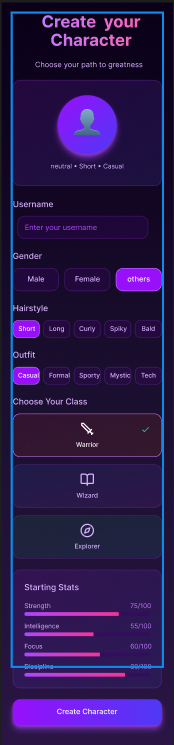
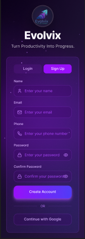
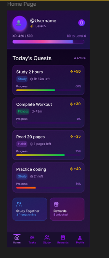
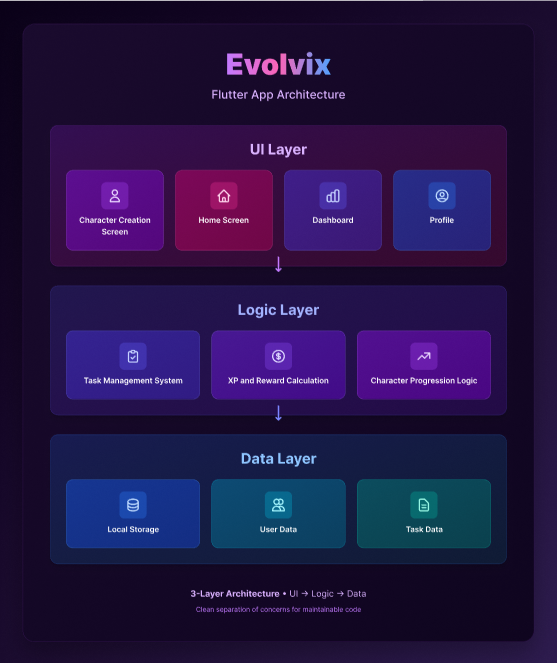

# 🎮 Evolvix – Gamified Productivity App

## 📌 Problem Statement
Many students and young professionals struggle to stay consistent with their daily tasks due to lack of motivation and engagement. Traditional productivity apps often feel repetitive and boring, leading to reduced usage over time.  

**Evolvix** solves this problem by introducing a **gamified productivity system** where users complete tasks to earn XP and grow a personalized virtual character, making productivity fun, engaging, and rewarding.

---

## 👥 Team Members

| Name | Role | Contribution |
|------|------|-------------|
| Vedika Singh | Development & Integration | Core app development, feature integration, project coordination |
| Anmol Kushwah | UI/UX Designer | Designed user interface, improved user experience, implemented responsive UI |
| Saptshya Pahari | Logic & Implementation | Built backend logic, XP system, task handling and data flow |

---

## 🛠 Tech Stack

- **Frontend:** Flutter  
- **Language:** Dart  
- **Design:** Figma (for wireframes and UI design)  
- **IDE:** Android Studio  
- **Version Control:** Git & GitHub  

---

## ⚙️ Setup & Run Instructions

Follow these steps to run the project on your system:

1. **Clone the repository**
   ```bash
   git clone <your-repository-link>
   ```

2. **Install dependencies**
   ```bash
   flutter pub get
   ```

3. **Run the app**
   ```bash
   flutter run
   ```

---

## 🎥 Demo Video
[Watch Demo](https://youtu.be/X5SQI_kf5aY)

---

## 📸 Screenshots

### Character Creation


### Sign up


### Dashboard


### Reward


### Profile


---

## 🏗 Architecture Diagram

